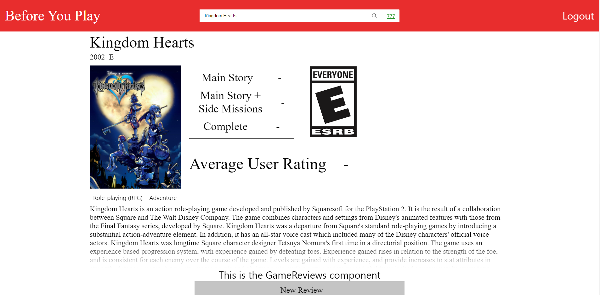

<div id="top"></div>

[![Contributors][contributors-shield]][contributors-url]
[![Forks][forks-shield]][forks-url]
[![Stargazers][stars-shield]][stars-url]
[![Issues][issues-shield]][issues-url]
[![License][license-shield]][license-url]
<!-- [![Website][live-site-shield]][live-site-url] -->


<!-- PROJECT LOGO -->
<br />
<div align="center">

<h1 align="center">Before You Play</h1>

  <p align="center">
    Before You Play was built from the need for pertanent information about a video game. Have you ever wondered, How long does the main story of [insert game title] take to finish? What are real players saying about this game? Well now we have an answer through Before You Play. 
    <br />
    <br />
    <a href="#demo">View Demo</a>
    ·
    <a href="https://github.com/Revivedaniel/BeforeYouPlay/issues">Report Bug</a>
    ·
    <a href="https://github.com/Revivedaniel/BeforeYouPlay/issues">Request Feature</a>
  </p>
</div>


<!-- TABLE OF CONTENTS -->
<details>
  <summary>Table of Contents</summary>
  <ol>
    <li>
      <a href="#about-the-project">About The Project</a>
      <ul>
        <li><a href="#built-with">Built With</a></li>
      </ul>
    </li>
    <li>
      <a href="#getting-started">Getting Started</a>
      <ul>
        <li><a href="#prerequisites">Prerequisites</a></li>
        <li><a href="#installation">Installation</a></li>
      </ul>
    </li>
    <li><a href="#usage">Usage</a></li>
    <li><a href="#roadmap">Roadmap</a></li>
    <li><a href="#contributing">Contributing</a></li>
    <li><a href="#license">License</a></li>
    <li><a href="#contact">Contact</a></li>
    <li><a href="#acknowledgments">Acknowledgments</a></li>
  </ol>
</details>


<!-- ABOUT THE PROJECT -->
## About The Project

[](https://beforeyouplay.herokuapp.com/)

<p align="right">(<a href="#top">back to top</a>)</p>


### Built With

* [MongoDB](https://www.mongodb.com/)
* [Express](https://www.npmjs.com/package/express)
* [React](https://reactjs.org/)
* [Node.js](https://nodejs.org/en/)
* [GraphQL](https://graphql.org/)
* [Apollo](https://www.apollographql.com/)
* [bcrypt](https://www.npmjs.com/package/bcrypt)
* [Axios](https://www.npmjs.com/package/axios)


<p align="right">(<a href="#top">back to top</a>)</p>

## Demo


<!-- GETTING STARTED -->
## Getting Started

Get a local copy up and running by following these simple steps.

### Prerequisites

npm and Node.js are required to run a local copy of this project.
* npm
  ```sh
  npm install npm@latest -g
  ```
* [Node.js](https://nodejs.org/en/)


### Installation

1. Clone the repo
   ```sh
   git clone https://github.com/Revivedaniel/BeforeYouPlay.git
   ```
2. Install NPM packages
   ```sh
   npm install
   ```
3. Seed the database
   ```sh
   npm run seed
   ```
4. Start the server
   ```sh
   npm start
   ```

<p align="right">(<a href="#top">back to top</a>)</p>

<!-- ROADMAP -->
## Roadmap

- [] Lots of style cleanup
- [] Bug catching and cleaning
- [] User profiles

See the [open issues](https://github.com/Revivedaniel/BeforeYouPlay/issues) for a full list of proposed features (and known issues).

<p align="right">(<a href="#top">back to top</a>)</p>


<!-- CONTRIBUTING -->
## Contributing

Contributions are what make the open source community such an amazing place to learn, inspire, and create. Any contributions you make are **greatly appreciated**.

If you have a suggestion that would make this better, please fork the repo and create a pull request. You can also simply open an issue with the tag "enhancement".
Don't forget to give the project a star! Thanks again!

1. Fork the Project
2. Create your Feature Branch (`git checkout -b feature/AmazingFeature`)
3. Commit your Changes (`git commit -m 'Add some AmazingFeature'`)
4. Push to the Branch (`git push origin feature/AmazingFeature`)
5. Open a Pull Request

<p align="right">(<a href="#top">back to top</a>)</p>


<!-- LICENSE -->
## License

Distributed under the GPL-2.0 License. See `LICENSE.txt` for more information.

<p align="right">(<a href="#top">back to top</a>)</p>


<!-- CONTACT -->
## Contact

Daniel Stark - daniel@danielstark.dev

Project Link: [https://github.com/Revivedaniel/BeforeYouPlay](https://github.com/Revivedaniel/BeforeYouPlay)

<p align="right">(<a href="#top">back to top</a>)</p>

[contributors-shield]: https://img.shields.io/github/contributors/Revivedaniel/BeforeYouPlay.svg?style=for-the-badge
[contributors-url]: https://github.com/Revivedaniel/BeforeYouPlay/graphs/contributors
[forks-shield]: https://img.shields.io/github/forks/Revivedaniel/BeforeYouPlay.svg?style=for-the-badge
[forks-url]: https://github.com/Revivedaniel/BeforeYouPlay/network/members
[stars-shield]: https://img.shields.io/github/stars/Revivedaniel/BeforeYouPlay.svg?style=for-the-badge
[stars-url]: https://github.com/Revivedaniel/BeforeYouPlay/stargazers
[issues-shield]: https://img.shields.io/github/issues/Revivedaniel/BeforeYouPlay.svg?style=for-the-badge
[issues-url]: https://github.com/Revivedaniel/BeforeYouPlay/issues
[license-shield]: https://img.shields.io/github/license/Revivedaniel/BeforeYouPlay.svg?style=for-the-badge
[license-url]: https://github.com/Revivedaniel/BeforeYouPlay/blob/main/LICENSE
[live-site-url]: https://beforeyouplay.herokuapp.com/
[live-site-shield]: https://img.shields.io/website?label=BeforeYouPlay&style=for-the-badge&url=https%3A%2F%2FBeforeYouPlay/