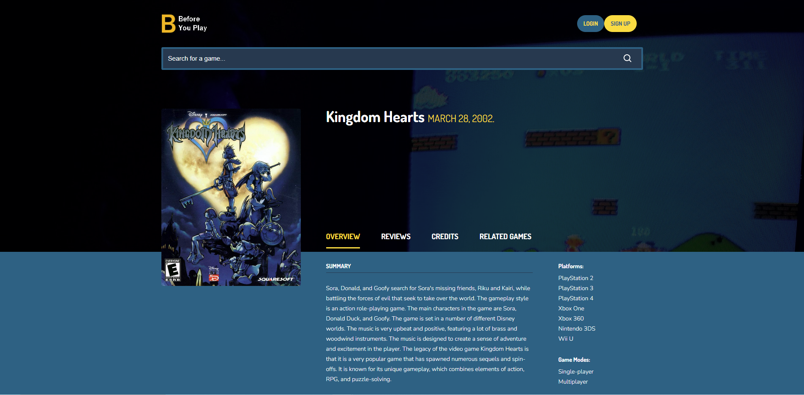

<div id="top"></div>

[![Contributors][contributors-shield]][contributors-url]
[![Forks][forks-shield]][forks-url]
[![Stargazers][stars-shield]][stars-url]
[![Issues][issues-shield]][issues-url]
[![License][license-shield]][license-url]
[![Website][live-site-shield]][live-site-url]


<!-- PROJECT LOGO -->
<br />
<div align="center">

<h1 align="center">Before You Play</h1>

  <p align="center">
     Introducing Before You Play, your ultimate spoiler-free gaming discovery platform, featuring insightful yet spoiler-free essays on each game to help you make an informed decision Before You Play! Our website is designed to help you effortlessly uncover new video games tailored to your interests, while providing essential information to guide your choices. Explore hidden gems and trending titles with our curated browsing experience that highlights a diverse range of games you might have never heard of before.

At Before You Play, parents can easily access age ratings, and gamers can quickly identify a game's genre, developer, and release date. Our in-depth, spoiler-free essays provide an unparalleled understanding of each game's unique appeal and features, ensuring you know what to expect before you play. Discover your next favorite game with Before You Play – your personalized, comprehensive, and spoiler-free guide to the gaming universe!
    <br />
    <br />
    <a href="#demo">View Demo</a>
    ·
    <a href="https://github.com/Revivedaniel/BeforeYouPlay/issues">Report Bug</a>
    ·
    <a href="https://github.com/Revivedaniel/BeforeYouPlay/issues">Request Feature</a>
  </p>
</div>


<!-- TABLE OF CONTENTS -->
<details>
  <summary>Table of Contents</summary>
  <ol>
    <li>
      <a href="#about-the-project">About The Project</a>
      <ul>
        <li><a href="#built-with">Built With</a></li>
      </ul>
    </li>
    <li>
      <a href="#getting-started">Getting Started</a>
      <ul>
        <li><a href="#prerequisites">Prerequisites</a></li>
        <li><a href="#installation">Installation</a></li>
      </ul>
    </li>
    <li><a href="#roadmap">Roadmap</a></li>
    <li><a href="#contributing">Contributing</a></li>
    <li><a href="#license">License</a></li>
    <li><a href="#contact">Contact</a></li>
  </ol>
</details>


<!-- ABOUT THE PROJECT -->
## About The Project

[](https://beforeyouplay.herokuapp.com/)

<p align="right">(<a href="#top">back to top</a>)</p>


## Frontend Tech
The Frontend of this app is built on the Next.js framework and leverages the !
* [Next.js](https://nextjs.org/)
* [Material UI](https://mui.com/)

## Backend Tech
The backend uses Apollo server to run a GraphQL API which connects to a CosmosDB for MongoDB Database and dynamically generates new game data using OpenAI's GPT 3.5 Model.
* [OpenAI](https://openai.com/)
* [GraphQL](https://graphql.org/)
* [Apollo](https://www.apollographql.com/)
* [MongoDB](https://www.mongodb.com/)
* [Express](https://www.npmjs.com/package/express)
* [Node.js](https://nodejs.org/en/)
* [bcrypt](https://www.npmjs.com/package/bcrypt)
* [Axios](https://www.npmjs.com/package/axios)

## Infrastructure
All the Infra for this project is Azure based including the seperate Video Game Information API!
* Frontend Client: [Azure Static Web Apps](https://azure.microsoft.com/en-us/products/app-service/static)
* Backend GraphQL API: [Azure Functions App](https://learn.microsoft.com/en-us/azure/azure-functions/functions-overview)
* Backend Database: [Azure CosmosDB for MongoDB](https://learn.microsoft.com/en-us/azure/cosmos-db/mongodb/introduction)
* VGI Game Images: [Azure Storage Accounts](https://learn.microsoft.com/en-us/azure/storage/common/storage-account-overview)
* VGI API Backend: [Azure Static Web Apps](https://azure.microsoft.com/en-us/products/app-service/static)
* VGI API Manager: [Azure API Manager](https://learn.microsoft.com/en-us/azure/api-management/)
<p align="right">(<a href="#top">back to top</a>)</p>

## Demo


<!-- GETTING STARTED -->
## Getting Started

Get a local copy up and running by following these simple steps.

### Prerequisites

npm and Node.js are required to run a local copy of this project.
* npm
  ```sh
  npm install npm@latest -g
  ```
* [Node.js](https://nodejs.org/en/)


### Installation

1. Clone the repo
   ```sh
   git clone https://github.com/Revivedaniel/BeforeYouPlay.git
   ```
2. Install NPM packages
   ```sh
   npm install
   ```
3. Seed the database
   ```sh
   npm run seed
   ```
4. Start the server
   ```sh
   npm start
   ```

<p align="right">(<a href="#top">back to top</a>)</p>

<!-- ROADMAP -->
## Roadmap

- Completely overhault styling.
- Update auth
- Continue making AI data more accurate 

See the [open issues](https://github.com/Revivedaniel/BeforeYouPlay/issues) for a full list of proposed features (and known issues).

<p align="right">(<a href="#top">back to top</a>)</p>


<!-- CONTRIBUTING -->
## Contributing

Contributions are what make the open source community such an amazing place to learn, inspire, and create. Any contributions you make are **greatly appreciated**.

If you have a suggestion that would make this better, please fork the repo and create a pull request. You can also simply open an issue with the tag "enhancement".
Don't forget to give the project a star! Thanks again!

1. Fork the Project
2. Create your Feature Branch (`git checkout -b feature/AmazingFeature`)
3. Commit your Changes (`git commit -m 'Add some AmazingFeature'`)
4. Push to the Branch (`git push origin feature/AmazingFeature`)
5. Open a Pull Request

<p align="right">(<a href="#top">back to top</a>)</p>


<!-- LICENSE -->
## License

Distributed under the GPL-2.0 License. See `LICENSE.txt` for more information.

<p align="right">(<a href="#top">back to top</a>)</p>


<!-- CONTACT -->
## Contact

Daniel Stark - contact@danielstark.dev

<!-- Project Link: [https://github.com/Revivedaniel/BeforeYouPlay](https://github.com/Revivedaniel/BeforeYouPlay) -->

<p align="right">(<a href="#top">back to top</a>)</p>

[contributors-shield]: https://img.shields.io/github/contributors/Revivedaniel/BeforeYouPlay.svg?style=for-the-badge
[contributors-url]: https://github.com/Revivedaniel/BeforeYouPlay/graphs/contributors
[forks-shield]: https://img.shields.io/github/forks/Revivedaniel/BeforeYouPlay.svg?style=for-the-badge
[forks-url]: https://github.com/Revivedaniel/BeforeYouPlay/network/members
[stars-shield]: https://img.shields.io/github/stars/Revivedaniel/BeforeYouPlay.svg?style=for-the-badge
[stars-url]: https://github.com/Revivedaniel/BeforeYouPlay/stargazers
[issues-shield]: https://img.shields.io/github/issues/Revivedaniel/BeforeYouPlay.svg?style=for-the-badge
[issues-url]: https://github.com/Revivedaniel/BeforeYouPlay/issues
[license-shield]: https://img.shields.io/github/license/Revivedaniel/BeforeYouPlay.svg?style=for-the-badge
[license-url]: https://github.com/Revivedaniel/BeforeYouPlay/blob/main/LICENSE
[live-site-url]: https://beforeyouplay.herokuapp.com/
[live-site-shield]: https://img.shields.io/website?label=beforeyouplay.info&style=for-the-badge&url=https%3A%2F%2Fwww.beforeyouplay.info/
